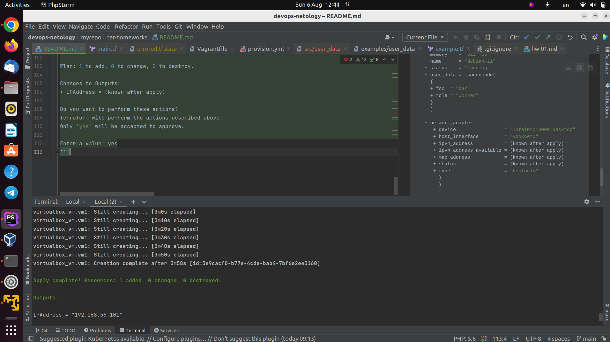
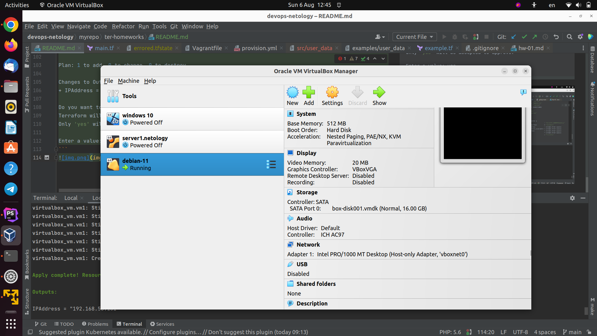

# Введение в Terraform

1. Перейдите в каталог src. Скачайте все необходимые зависимости, использованные в проекте.
2. Изучите файл .gitignore. В каком terraform-файле, согласно этому .gitignore, допустимо сохранить личную, секретную информацию?
```
personal.auto.tfvars
```
3. Выполните код проекта. Найдите в state-файле секретное содержимое созданного ресурса random_password, пришлите в качестве ответа конкретный ключ и его значение.
```
"bcrypt_hash": "$2a$10$Wk8whVyd/5ub3UDZ9M74I.bY4DElXxq4zVcaT820eCfUZrpdGnf1y"
```
4. Раскомментируйте блок кода, примерно расположенный на строчках 29–42 файла main.tf. Выполните команду terraform validate. Объясните, в чём заключаются намеренно допущенные ошибки. Исправьте их.

- Обязательно наличие имени ресурса
- Начинаться должно с буквы
- Доступ к ресурсу через тип.имя_ресурса

```terraform
resource "docker_image" "image"{
  name         = "nginx:latest"
  keep_locally = true
}

resource "docker_container" "nginx" {
  image = docker_image.image.image_id
  name  = "example_${random_password.random_string.result}"

  ports {
    internal = 80
    external = 8000
  }
}
```
5. Выполните код. В качестве ответа приложите вывод команды docker ps.
```bash
yurykov@yurykov:~/projects/devops-netology/terraform/01/src$ sudo docker ps
CONTAINER ID   IMAGE          COMMAND                  CREATED         STATUS         PORTS                  NAMES
8eccf535fc7d   89da1fb6dcb9   "/docker-entrypoint.…"   7 seconds ago   Up 6 seconds   0.0.0.0:8000->80/tcp   example_DauDXIYe3Gl3Z15f
```
6. Замените имя docker-контейнера в блоке кода на hello_world. Не перепутайте имя контейнера и имя образа. Мы всё ещё продолжаем использовать name = "nginx:latest". Выполните команду terraform apply -auto-approve. Объясните своими словами, в чём может быть опасность применения ключа -auto-approve. В качестве ответа дополнительно приложите вывод команды docker ps.
auto-approve - выполняет комманду terraform apply без подтверждение.
Здесь надо быть уверенным, что никто не сможет изменить инфраструктуру за пределами рабочего процесса terraform.
```bash
yurykov@yurykov:~/projects/devops-netology/terraform/01/src$ sudo docker ps
CONTAINER ID   IMAGE          COMMAND                  CREATED         STATUS         PORTS                  NAMES
cdb2eaecae4c   89da1fb6dcb9   "/docker-entrypoint.…"   3 minutes ago   Up 3 minutes   0.0.0.0:8000->80/tcp   hello_world
```
7. Уничтожьте созданные ресурсы с помощью terraform. Убедитесь, что все ресурсы удалены. Приложите содержимое файла terraform.tfstate.
```terraform
{
  "version": 4,
  "terraform_version": "1.5.3",
  "serial": 11,
  "lineage": "ccc16e2f-31f9-cb68-4d39-719b0ad3c332",
  "outputs": {},
  "resources": [],
  "check_results": null
}
```
8. Объясните, почему при этом не был удалён docker-образ nginx:latest. Ответ подкрепите выдержкой из документации провайдера docker.
   - keep_locally 
   - Если true, то образ Docker не будет удален при операции уничтожения. 

9. Задание 2*
   - Изучите в документации provider Virtualbox от shekeriev.
   - Создайте с его помощью любую виртуальную машину. Чтобы не использовать VPN, советуем выбрать любой образ с расположением в GitHub из списка.
   - В качестве ответа приложите plan для создаваемого ресурса и скриншот созданного в VB ресурса.
```bash
yurykov@yurykov:~/projects/devops-netology/terraform/01/src$ sudo terraform apply
[sudo] password for yurykov:

Terraform used the selected providers to generate the following execution plan. Resource actions are indicated with the following symbols:
+ create

Terraform will perform the following actions:

# virtualbox_vm.vm1 will be created
+ resource "virtualbox_vm" "vm1" {
   + cpus      = 1
   + id        = (known after apply)
   + image     = "https://app.vagrantup.com/shekeriev/boxes/debian-11/versions/0.2/providers/virtualbox.box"
   + memory    = "512 mib"
   + name      = "debian-11"
   + status    = "running"
   + user_data = jsonencode(
     {
     + foo  = "bar"
     + role = "worker"
     }
     )

   + network_adapter {
      + device                 = "IntelPro1000MTDesktop"
      + host_interface         = "vboxnet0"
      + ipv4_address           = (known after apply)
      + ipv4_address_available = (known after apply)
      + mac_address            = (known after apply)
      + status                 = (known after apply)
      + type                   = "hostonly"
        }
        }

Plan: 1 to add, 0 to change, 0 to destroy.

Changes to Outputs:
+ IPAddress = (known after apply)

Do you want to perform these actions?
Terraform will perform the actions described above.
Only 'yes' will be accepted to approve.

Enter a value: yes
```

