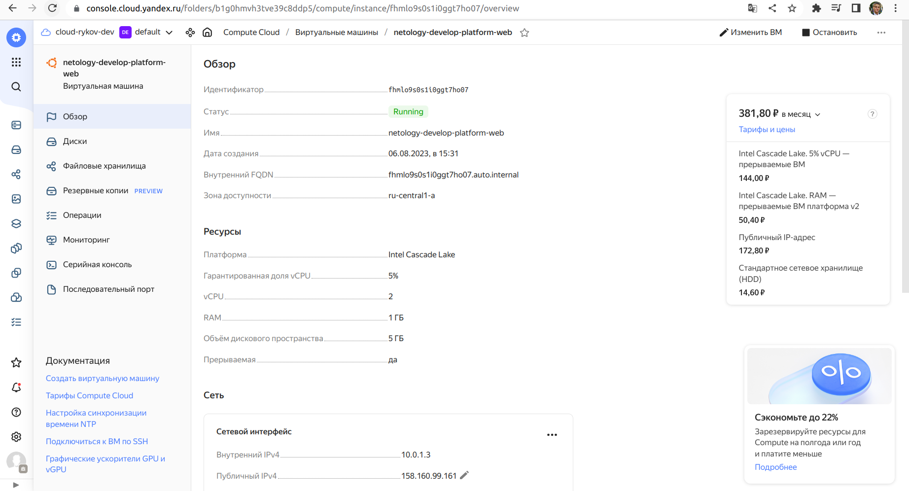
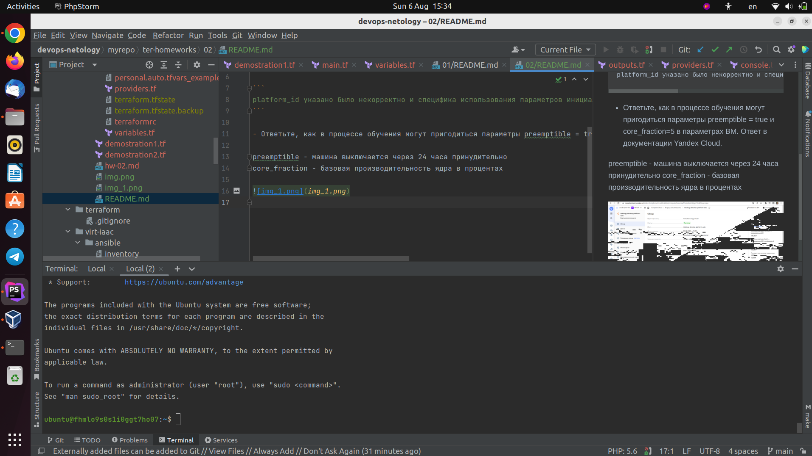

# Основы Terraform. Yandex Cloud

1. Задание 1

- Инициализируйте проект, выполните код. Исправьте намеренно допущенные синтаксические ошибки. Ищите внимательно, посимвольно. Ответьте, в чём заключается их суть.

```
platform_id указано было некорректно и специфика использования параметров инициализации (минимум 2 ядра для v2)
```

- Ответьте, как в процессе обучения могут пригодиться параметры preemptible = true и core_fraction=5 в параметрах ВМ. Ответ в документации Yandex Cloud.

preemptible - машина выключается через 24 часа принудительно
core_fraction - базовая производительность ядра в процентах




2. Задание 4

```bash
yurykov@yurykov:~/projects/devops-netology/myrepo/ter-homeworks/02/src$ terraform output
external_ip_address_netology-develop-platform-db_yandex_cloud = "158.160.50.127"
external_ip_address_platform_yandex_cloud = "158.160.99.161"
```
3. Задание 7*

Изучите содержимое файла console.tf. Откройте terraform console, выполните следующие задания:

- Напишите, какой командой можно отобразить второй элемент списка test_list.

```
> local.test_list[1]
"staging"
```

- Найдите длину списка test_list с помощью функции length(<имя переменной>).

 ```
> length(local.test_list)
3

 ```

- Напишите, какой командой можно отобразить значение ключа admin из map test_map.

```
> local.test_map.admin
"John"
```

Напишите interpolation-выражение, результатом которого будет: "John is admin for production server based on OS ubuntu-20-04 with X vcpu, Y ram and Z virtual disks", используйте данные из переменных test_list, test_map, servers и функцию length() для подстановки значений.

```bash
> "${local.test_map.admin} is admin for ${local.test_list[2]} server based on OS ${local.servers.production.image} with ${local.servers.production.cpu} vcpu, ${local.servers.production.ram} ram and ${length(local.servers.production.disks)} virtual disks"
"John is admin for production server based on OS ubuntu-20-04 with 10 vcpu, 40 ram and 4 virtual disks"
```